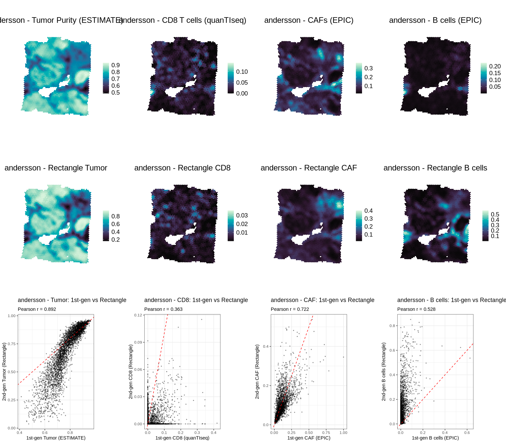
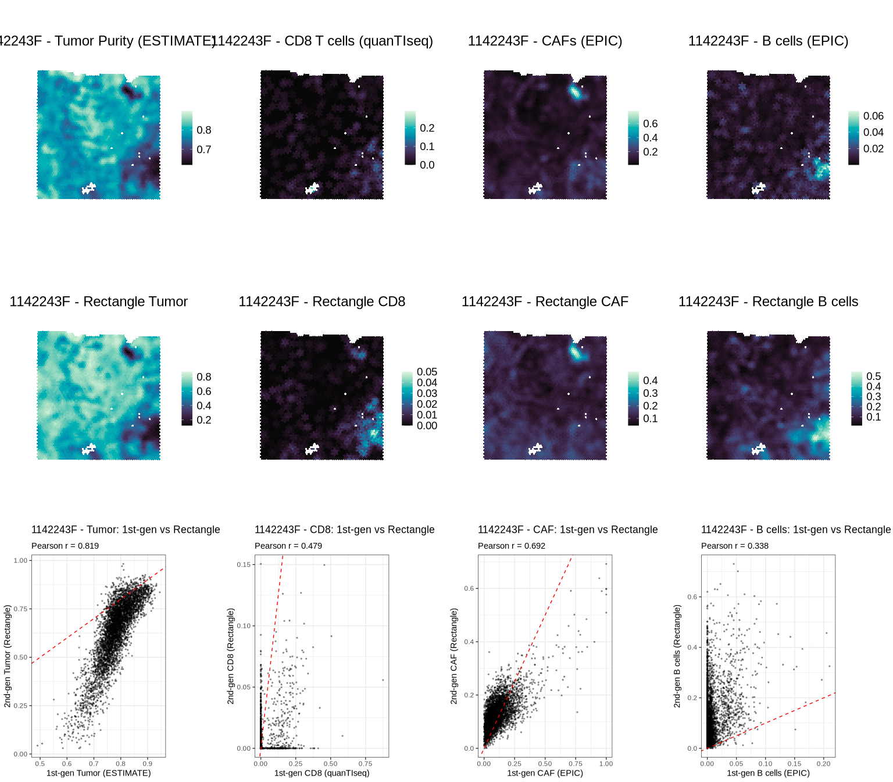
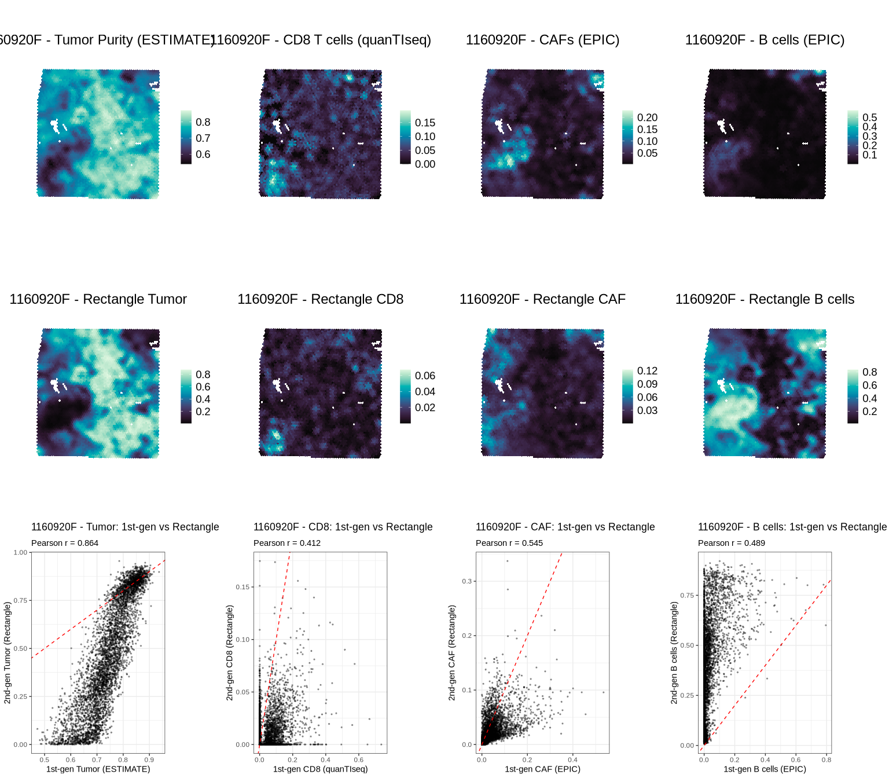
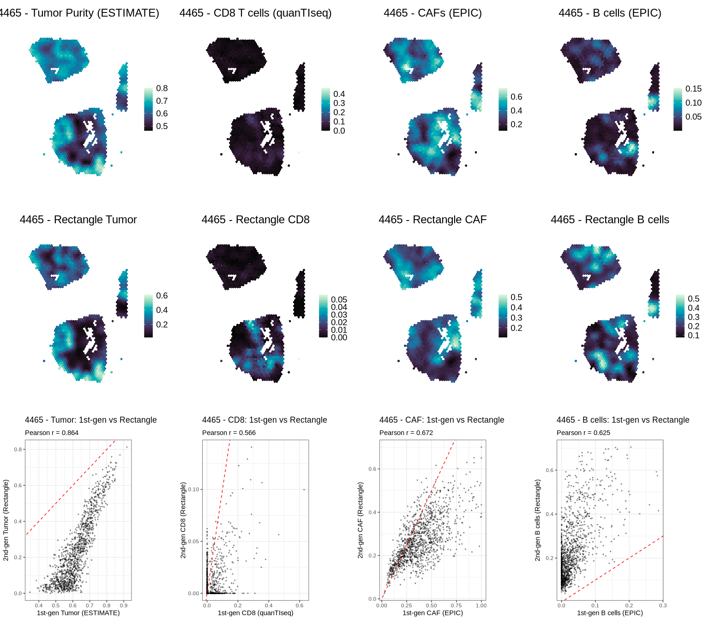
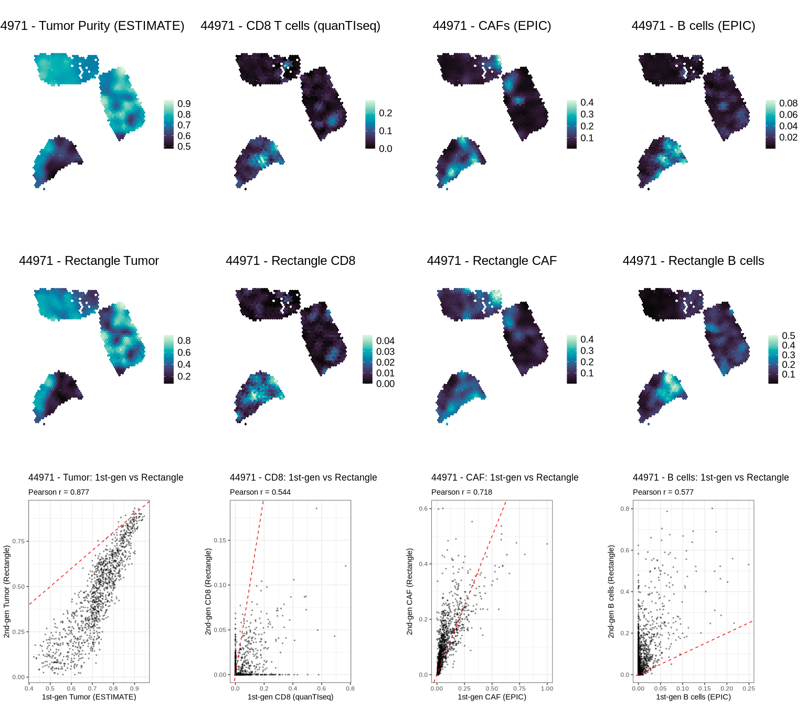
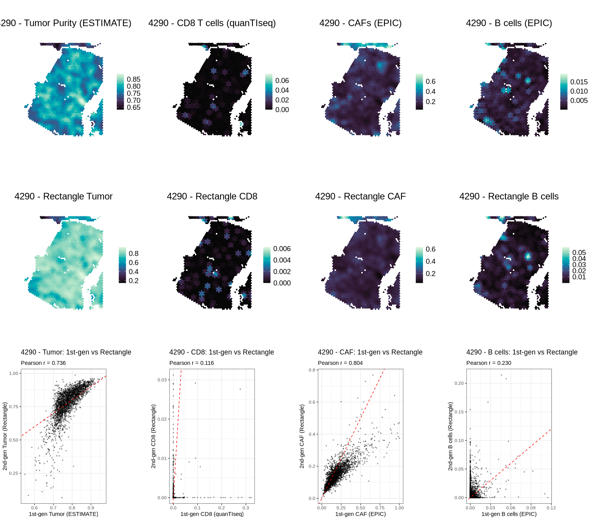
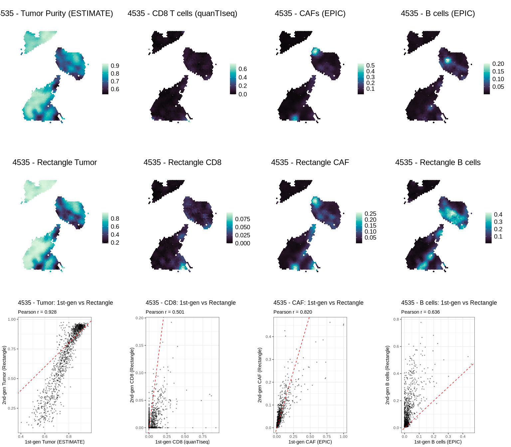

``` r
library(spacedeconv)
library(ggplot2)
library(cowplot)

dir.create("../results/plots", recursive = TRUE, showWarnings = FALSE)

slides <- c("andersson", "1142243F", "1160920F", "4465", "44971", "4290", "4535")
title_size <- 18
font_size <- 14
legend_size <- 14
```

## Methods

Normalization and deconvolution follow the spacedeconv paper scripts;
execution is implemented in `scripts/run_spacedeconv.R`.

- `preprocess(min_umi = 87)`
- `spacedeconv::normalize(...)`
- `deconvolute(method = "estimate", assay_sp = "cpm")`
- `deconvolute(method = "quantiseq", assay_sp = "cpm", tumor = TRUE)`
- `deconvolute(method = "epic", assay_sp = "cpm", tumor = TRUE)`

Rectangle integration is executed by:

- `scripts/export_spatial_for_rectangle.R`
- `scripts/run_rectangle.py`
- `scripts/merge_rectangle_results.R`

## Per-slide Spatial Results

``` r
for (i in seq_along(slides)) {
  slide <- slides[[i]]
  if (i > 1) {
    cat("\n\n---\n\n")
  }

  est <- readRDS(file.path("../results/objects", paste0("deconv_estimate_", slide, ".rds")))
  qua <- readRDS(file.path("../results/objects", paste0("deconv_quantiseq_", slide, ".rds")))
  epi <- readRDS(file.path("../results/objects", paste0("deconv_epic_", slide, ".rds")))

  p_tumor <- plot_spatial(
    est,
    result = "estimate_tumor.purity",
    smooth = TRUE,
    density = FALSE,
    title = paste0(slide, " - Tumor Purity (ESTIMATE)"),
    title_size = title_size,
    font_size = font_size,
    legend_size = legend_size
  )

  p_cd8 <- plot_spatial(
    qua,
    result = "quantiseq_T.cell.CD8.",
    smooth = TRUE,
    density = FALSE,
    shift_positive = FALSE,
    title = paste0(slide, " - CD8 T cells (quanTIseq)"),
    title_size = title_size,
    font_size = font_size,
    legend_size = legend_size
  )

  p_caf <- plot_spatial(
    epi,
    result = "epic_Cancer.associated.fibroblast",
    smooth = TRUE,
    density = FALSE,
    title = paste0(slide, " - CAFs (EPIC)"),
    title_size = title_size,
    font_size = font_size,
    legend_size = legend_size
  )

  rect_csv <- file.path("../results/objects", paste0("deconv_rectangle_", slide, ".csv"))
  if (file.exists(rect_csv)) {
    rect <- read.csv(rect_csv, stringsAsFactors = FALSE, check.names = FALSE)
    req <- c(
      "T cells CD8+",
      "CAFs MSC iCAF-like",
      "CAFs myCAF-like",
      "Cancer Her2 SC",
      "Cancer LumB SC",
      "Cancer Basal SC",
      "Cancer LumA SC",
      "Unknown",
      "B cells Memory",
      "B cells Naive",
      "Plasmablasts"
    )

    if (all(req %in% colnames(rect))) {
      rect_cd8 <- rect[["T cells CD8+"]]
      rect_caf <- rect[["CAFs MSC iCAF-like"]] + rect[["CAFs myCAF-like"]]
      rect_tumor <- rect[["Cancer Her2 SC"]] + rect[["Cancer LumB SC"]] +
        rect[["Cancer Basal SC"]] + rect[["Cancer LumA SC"]] + rect[["Unknown"]]
      rect_bcells <- rect[["B cells Memory"]] + rect[["B cells Naive"]] + rect[["Plasmablasts"]]

      idx <- match(colnames(est), rect$spot_id)
      SummarizedExperiment::colData(est)$rectangle_cd8 <- rect_cd8[idx]
      SummarizedExperiment::colData(est)$rectangle_caf <- rect_caf[idx]
      SummarizedExperiment::colData(est)$rectangle_tumor <- rect_tumor[idx]
      SummarizedExperiment::colData(est)$rectangle_bcells <- rect_bcells[idx]

      p_rect_cd8 <- plot_spatial(
        est,
        result = "rectangle_cd8",
        smooth = TRUE,
        density = FALSE,
        shift_positive = FALSE,
        title = paste0(slide, " - Rectangle CD8"),
        title_size = title_size,
        font_size = font_size,
        legend_size = legend_size
      )

      p_rect_caf <- plot_spatial(
        est,
        result = "rectangle_caf",
        smooth = TRUE,
        density = FALSE,
        shift_positive = FALSE,
        title = paste0(slide, " - Rectangle CAF"),
        title_size = title_size,
        font_size = font_size,
        legend_size = legend_size
      )

      p_rect_tumor <- plot_spatial(
        est,
        result = "rectangle_tumor",
        smooth = TRUE,
        density = FALSE,
        shift_positive = FALSE,
        title = paste0(slide, " - Rectangle Tumor"),
        title_size = title_size,
        font_size = font_size,
        legend_size = legend_size
      )

      p_bcells <- plot_spatial(
        epi,
        result = "epic_B.cell",
        smooth = TRUE,
        density = FALSE,
        shift_positive = FALSE,
        title = paste0(slide, " - B cells (EPIC)"),
        title_size = title_size,
        font_size = font_size,
        legend_size = legend_size
      )

      p_rect_bcells <- plot_spatial(
        est,
        result = "rectangle_bcells",
        smooth = TRUE,
        density = FALSE,
        shift_positive = FALSE,
        title = paste0(slide, " - Rectangle B cells"),
        title_size = title_size,
        font_size = font_size,
        legend_size = legend_size
      )

      first_tumor <- SummarizedExperiment::colData(est)$estimate_tumor.purity
      first_cd8 <- SummarizedExperiment::colData(qua)$quantiseq_T.cell.CD8.
      first_caf <- SummarizedExperiment::colData(epi)$epic_Cancer.associated.fibroblast
      first_bcells <- SummarizedExperiment::colData(epi)$epic_B.cell

      mk_scatter <- function(x, y, title, xlab, ylab) {
        d <- data.frame(x = as.numeric(x), y = as.numeric(y))
        d <- d[stats::complete.cases(d), , drop = FALSE]
        r <- if (nrow(d) > 1) stats::cor(d$x, d$y, method = "pearson") else NA_real_
        ggplot(d, aes(x = x, y = y)) +
          geom_point(size = 0.5, alpha = 0.35) +
          geom_abline(slope = 1, intercept = 0, linetype = "dashed", color = "red") +
          labs(
            title = title,
            subtitle = paste0("Pearson r = ", ifelse(is.na(r), "NA", sprintf("%.3f", r))),
            x = xlab,
            y = ylab
          ) +
          theme_bw(base_size = 11)
      }

      p_sc_tumor <- mk_scatter(
        first_tumor, rect_tumor[idx],
        paste0(slide, " - Tumor: 1st-gen vs Rectangle"),
        "1st-gen Tumor (ESTIMATE)",
        "2nd-gen Tumor (Rectangle)"
      )
      p_sc_cd8 <- mk_scatter(
        first_cd8, rect_cd8[idx],
        paste0(slide, " - CD8: 1st-gen vs Rectangle"),
        "1st-gen CD8 (quanTIseq)",
        "2nd-gen CD8 (Rectangle)"
      )
      p_sc_caf <- mk_scatter(
        first_caf, rect_caf[idx],
        paste0(slide, " - CAF: 1st-gen vs Rectangle"),
        "1st-gen CAF (EPIC)",
        "2nd-gen CAF (Rectangle)"
      )
      p_sc_bcells <- mk_scatter(
        first_bcells, rect_bcells[idx],
        paste0(slide, " - B cells: 1st-gen vs Rectangle"),
        "1st-gen B cells (EPIC)",
        "2nd-gen B cells (Rectangle)"
      )

      panel <- cowplot::plot_grid(
        p_tumor, p_cd8, p_caf, p_bcells,
        p_rect_tumor, p_rect_cd8, p_rect_caf, p_rect_bcells,
        p_sc_tumor, p_sc_cd8, p_sc_caf, p_sc_bcells,
        ncol = 4, align = "hv"
      )
    } else {
      p_bcells <- plot_spatial(
        epi,
        result = "epic_B.cell",
        smooth = TRUE,
        density = FALSE,
        shift_positive = FALSE,
        title = paste0(slide, " - B cells (EPIC)"),
        title_size = title_size,
        font_size = font_size,
        legend_size = legend_size
      )
      panel <- cowplot::plot_grid(p_tumor, p_cd8, p_caf, p_bcells, ncol = 4, align = "hv")
    }
  } else {
    p_bcells <- plot_spatial(
      epi,
      result = "epic_B.cell",
      smooth = TRUE,
      density = FALSE,
      shift_positive = FALSE,
      title = paste0(slide, " - B cells (EPIC)"),
      title_size = title_size,
      font_size = font_size,
      legend_size = legend_size
    )
    panel <- cowplot::plot_grid(p_tumor, p_cd8, p_caf, p_bcells, ncol = 4, align = "hv")
  }

  print(panel)

  ggsave(
    filename = file.path("../results/plots", paste0("slide_", slide, "_targets.png")),
    plot = panel,
    width = 20,
    height = 14,
    units = "in",
    dpi = 300,
    bg = "white"
  )
}
```

<!-- -->

------------------------------------------------------------------------

<!-- -->

------------------------------------------------------------------------

<!-- -->

------------------------------------------------------------------------

<!-- -->

------------------------------------------------------------------------

<!-- -->

------------------------------------------------------------------------

<!-- -->

------------------------------------------------------------------------

<!-- -->

## Rectangle vs Existing Methods

``` r
tab <- read.csv("../results/tables/targets_all_slides.csv", stringsAsFactors = FALSE, check.names = FALSE)
rect_cols <- grep("^rectangle_", colnames(tab), value = TRUE)

if (length(rect_cols) == 0) {
  cat("Rectangle columns not found in combined table. Run merge script first.")
} else {
  pick_col <- function(patterns) {
    for (p in patterns) {
      hit <- grep(p, rect_cols, value = TRUE, ignore.case = TRUE)
      if (length(hit) > 0) {
        return(hit[[1]])
      }
    }
    NA_character_
  }

  rect_cd8 <- pick_col(c("cd8", "t.cell", "cytotoxic"))
  rect_caf <- pick_col(c("caf", "fibro", "fibroblast", "stromal"))
  rect_bcells <- pick_col(c("bcells", "b.cell", "plasmablast"))

  out <- data.frame(
    metric = c("CD8 method correlation", "CAF method correlation", "B-cell method correlation"),
    rectangle_column = c(rect_cd8, rect_caf, rect_bcells),
    correlation = c(NA_real_, NA_real_, NA_real_),
    stringsAsFactors = FALSE
  )

  if (!is.na(rect_cd8) && "cd8_quantiseq" %in% colnames(tab)) {
    out$correlation[out$metric == "CD8 method correlation"] <- suppressWarnings(
      cor(tab[[rect_cd8]], tab$cd8_quantiseq, use = "pairwise.complete.obs")
    )
  }

  if (!is.na(rect_caf) && "caf_epic" %in% colnames(tab)) {
    out$correlation[out$metric == "CAF method correlation"] <- suppressWarnings(
      cor(tab[[rect_caf]], tab$caf_epic, use = "pairwise.complete.obs")
    )
  }

  if (!is.na(rect_bcells) && "epic_B.cell" %in% colnames(tab)) {
    out$correlation[out$metric == "B-cell method correlation"] <- suppressWarnings(
      cor(tab[[rect_bcells]], tab[["epic_B.cell"]], use = "pairwise.complete.obs")
    )
  }

  knitr::kable(out)
}
```

| metric                    | rectangle_column             | correlation |
|:--------------------------|:-----------------------------|------------:|
| CD8 method correlation    | rectangle_T.cells.CD8.       |   0.4886817 |
| CAF method correlation    | rectangle_CAFs.MSC.iCAF.like |   0.0254996 |
| B-cell method correlation | rectangle_bcells             |          NA |

## Combined Table Preview

``` r
tab <- read.csv("../results/tables/targets_all_slides.csv")
knitr::kable(head(tab, 20))
```

| spot_id | slide_id | tumor_purity_estimate | cd8_quantiseq | caf_epic | pxl_col_in_fullres | pxl_row_in_fullres | rectangle_B.cells.Memory | rectangle_B.cells.Naive | rectangle_CAFs.MSC.iCAF.like | rectangle_CAFs.myCAF.like | rectangle_Cancer.Basal.SC | rectangle_Cancer.Her2.SC | rectangle_Cancer.LumA.SC | rectangle_Cancer.LumB.SC | rectangle_DCs | rectangle_Endothelial.ACKR1 | rectangle_Endothelial.CXCL12 | rectangle_Endothelial.Lymphatic.LYVE1 | rectangle_Endothelial.RGS5 | rectangle_Macrophage | rectangle_Monocyte | rectangle_NK.cells | rectangle_NKT.cells | rectangle_PVL.Differentiated | rectangle_PVL.Immature | rectangle_Plasmablasts | rectangle_T.cells.CD4. | rectangle_T.cells.CD8. | rectangle_Unknown | rectangle_cd8 | rectangle_caf | rectangle_tumor | rectangle_bcells |
|:---|:---|---:|---:|---:|---:|---:|---:|---:|---:|---:|---:|---:|---:|---:|---:|---:|---:|---:|---:|---:|---:|---:|---:|---:|---:|---:|---:|---:|---:|---:|---:|---:|---:|
| AAACAAGTATCTCCCA-1 | andersson | 0.5339460 | 0.0871836 | 0.2495293 | 17428 | 15937 | 0.0501497 | 0.0266308 | 0.1406418 | 0.0839039 | 0.0000000 | 0.0075550 | 0.0059735 | 0.1769761 | 0.0000000 | 0.0069837 | 0.0000000 | 0.0144462 | 0.0000000 | 0.1121091 | 0.0000000 | 0.0000000 | 0.0157839 | 0.0000000 | 0.0000000 | 0.3114611 | 0.0473852 | 0.0000000 | 0 | 0.0000000 | 0.2245457 | 0.1905045 | 0.3882416 |
| AAACACCAATAACTGC-1 | andersson | 0.8913474 | 0.0000000 | 0.0419921 | 6092 | 18054 | 0.0074565 | 0.0000000 | 0.0000000 | 0.0373291 | 0.0000000 | 0.0000000 | 0.2666318 | 0.5970405 | 0.0000000 | 0.0103038 | 0.0086930 | 0.0004935 | 0.0123553 | 0.0362822 | 0.0000000 | 0.0000618 | 0.0021794 | 0.0004365 | 0.0004716 | 0.0009551 | 0.0191443 | 0.0001655 | 0 | 0.0001655 | 0.0373291 | 0.8636723 | 0.0084116 |
| AAACAGAGCGACTCCT-1 | andersson | 0.7072153 | 0.0000000 | 0.1191177 | 16351 | 7383 | 0.0098232 | 0.0006526 | 0.1176037 | 0.0896541 | 0.0000000 | 0.0035756 | 0.2182837 | 0.2509523 | 0.0000000 | 0.0442392 | 0.0170961 | 0.0003363 | 0.0018443 | 0.0578972 | 0.0000000 | 0.0000000 | 0.0000000 | 0.0226944 | 0.0000258 | 0.1467402 | 0.0185814 | 0.0000000 | 0 | 0.0000000 | 0.2072578 | 0.4728115 | 0.1572160 |
| AAACAGGGTCTATATT-1 | andersson | 0.5154692 | 0.1148961 | 0.0424538 | 5278 | 15202 | 0.0044474 | 0.1693358 | 0.0651675 | 0.0003214 | 0.0012364 | 0.0000000 | 0.0000000 | 0.0526989 | 0.0005876 | 0.0080821 | 0.0034648 | 0.0065632 | 0.0002665 | 0.0526273 | 0.0097502 | 0.0000000 | 0.0082132 | 0.0000000 | 0.0092215 | 0.5738284 | 0.0211250 | 0.0130628 | 0 | 0.0130628 | 0.0654889 | 0.0539353 | 0.7476117 |
| AAACAGTGTTCCTGGG-1 | andersson | 0.8476866 | 0.0000000 | 0.1106762 | 9363 | 21386 | 0.0000291 | 0.0000000 | 0.0000000 | 0.1228636 | 0.0000000 | 0.0264198 | 0.4246001 | 0.3160945 | 0.0000000 | 0.0000475 | 0.0009044 | 0.0101102 | 0.0258428 | 0.0488592 | 0.0000000 | 0.0000000 | 0.0000000 | 0.0023984 | 0.0000000 | 0.0089205 | 0.0129099 | 0.0000000 | 0 | 0.0000000 | 0.1228636 | 0.7671144 | 0.0089496 |
| AAACATTTCCCGGATT-1 | andersson | 0.8841088 | 0.0324866 | 0.0301322 | 16740 | 18549 | 0.0059929 | 0.0062991 | 0.0025000 | 0.0270072 | 0.0000000 | 0.0404122 | 0.2448762 | 0.5951687 | 0.0000000 | 0.0000000 | 0.0003992 | 0.0005753 | 0.0127382 | 0.0522793 | 0.0000000 | 0.0000000 | 0.0052602 | 0.0000000 | 0.0000000 | 0.0064915 | 0.0000000 | 0.0000000 | 0 | 0.0000000 | 0.0295072 | 0.8804570 | 0.0187835 |
| AAACCCGAACGAAATC-1 | andersson | 0.5437192 | 0.0000000 | 0.2154445 | 19205 | 14752 | 0.0028808 | 0.0029405 | 0.0514767 | 0.1128346 | 0.0001609 | 0.0179932 | 0.0798569 | 0.1375747 | 0.0000000 | 0.0163766 | 0.0000000 | 0.0035103 | 0.0141820 | 0.1107053 | 0.0000000 | 0.0000000 | 0.0009872 | 0.0019494 | 0.0150606 | 0.3843314 | 0.0471789 | 0.0000000 | 0 | 0.0000000 | 0.1643113 | 0.2355857 | 0.3901527 |
| AAACCGGGTAGGTACC-1 | andersson | 0.9024869 | 0.0000000 | 0.0238491 | 7328 | 14018 | 0.0046933 | 0.0000000 | 0.0000000 | 0.0194773 | 0.0000000 | 0.0654311 | 0.2401754 | 0.6116077 | 0.0000000 | 0.0017255 | 0.0000000 | 0.0026320 | 0.0046450 | 0.0407780 | 0.0000000 | 0.0000000 | 0.0000000 | 0.0002551 | 0.0000000 | 0.0018077 | 0.0067719 | 0.0000000 | 0 | 0.0000000 | 0.0194773 | 0.9172142 | 0.0065010 |
| AAACCTAAGCAGCCGG-1 | andersson | 0.8391736 | 0.0000000 | 0.0974704 | 14827 | 19495 | 0.0071392 | 0.0000000 | 0.0000000 | 0.0850069 | 0.0000000 | 0.0587853 | 0.2898426 | 0.4316990 | 0.0000000 | 0.0028628 | 0.0001318 | 0.0008412 | 0.0106083 | 0.0469751 | 0.0000000 | 0.0000000 | 0.0016367 | 0.0000336 | 0.0146385 | 0.0479513 | 0.0000000 | 0.0018478 | 0 | 0.0018478 | 0.0850069 | 0.7803269 | 0.0550905 |
| AAACCTCATGAAGTTG-1 | andersson | 0.7184005 | 0.0615161 | 0.1841585 | 6102 | 12828 | 0.0047508 | 0.0176011 | 0.0000000 | 0.1229345 | 0.0000000 | 0.0206276 | 0.2851940 | 0.2602810 | 0.0000000 | 0.0074570 | 0.0079902 | 0.0017924 | 0.0000933 | 0.0854518 | 0.0000000 | 0.0000000 | 0.0083368 | 0.0002791 | 0.0000000 | 0.1771278 | 0.0000827 | 0.0000000 | 0 | 0.0000000 | 0.1229345 | 0.5661026 | 0.1994797 |
| AAACGAAGAACATACC-1 | andersson | 0.8814044 | 0.0688613 | 0.0241004 | 12259 | 5475 | 0.0050151 | 0.0057390 | 0.0087745 | 0.0208182 | 0.0104623 | 0.0629261 | 0.1306820 | 0.7073497 | 0.0000000 | 0.0012939 | 0.0032503 | 0.0016682 | 0.0000000 | 0.0291371 | 0.0000000 | 0.0000000 | 0.0000000 | 0.0013094 | 0.0000000 | 0.0001988 | 0.0089185 | 0.0024570 | 0 | 0.0024570 | 0.0295927 | 0.9114201 | 0.0109529 |
| AAACGAGACGGTTGAT-1 | andersson | 0.7612716 | 0.0275129 | 0.0913638 | 14294 | 12368 | 0.0038925 | 0.0056734 | 0.0252138 | 0.0597814 | 0.0000000 | 0.0053308 | 0.1956797 | 0.5930813 | 0.0000000 | 0.0008606 | 0.0000000 | 0.0008623 | 0.0005894 | 0.0551863 | 0.0000171 | 0.0000000 | 0.0000000 | 0.0000329 | 0.0005775 | 0.0001360 | 0.0530850 | 0.0000000 | 0 | 0.0000000 | 0.0849953 | 0.7940918 | 0.0097019 |
| AAACGCCCGAGATCGG-1 | andersson | 0.7687589 | 0.0000000 | 0.0516603 | 18267 | 5011 | 0.0062979 | 0.0000000 | 0.0000000 | 0.0530647 | 0.0000000 | 0.0039437 | 0.3984234 | 0.3147876 | 0.0000000 | 0.0190202 | 0.0248885 | 0.0008045 | 0.0005888 | 0.0658064 | 0.0000000 | 0.0000000 | 0.0000000 | 0.0062817 | 0.0001919 | 0.1059006 | 0.0000000 | 0.0000000 | 0 | 0.0000000 | 0.0530647 | 0.7171547 | 0.1121985 |
| AAACGGGCGTACGGGT-1 | andersson | 0.8917116 | 0.0182992 | 0.0301744 | 15919 | 19497 | 0.0054740 | 0.0000000 | 0.0000000 | 0.0280256 | 0.0001963 | 0.0425671 | 0.1621695 | 0.6683236 | 0.0000000 | 0.0000000 | 0.0000722 | 0.0079678 | 0.0080505 | 0.0426481 | 0.0135469 | 0.0000014 | 0.0004270 | 0.0000326 | 0.0000000 | 0.0017547 | 0.0113934 | 0.0073491 | 0 | 0.0073491 | 0.0280256 | 0.8732566 | 0.0072286 |
| AAACGGTTGCGAACTG-1 | andersson | 0.7230822 | 0.0000000 | 0.1443731 | 11550 | 19964 | 0.0058480 | 0.0000000 | 0.0000000 | 0.1026272 | 0.0000000 | 0.0009709 | 0.3793356 | 0.1871707 | 0.0000000 | 0.0000000 | 0.0000000 | 0.0000061 | 0.0181729 | 0.1246743 | 0.0000000 | 0.0000000 | 0.0000000 | 0.0000000 | 0.0017205 | 0.1451402 | 0.0343337 | 0.0000000 | 0 | 0.0000000 | 0.1026272 | 0.5674772 | 0.1509882 |
| AAACGTGTTCGCCCTA-1 | andersson | 0.6892423 | 0.0000000 | 0.0681070 | 19628 | 7389 | 0.0041347 | 0.0000000 | 0.1400806 | 0.0289693 | 0.0000000 | 0.0000000 | 0.0881212 | 0.3652182 | 0.0000000 | 0.0282863 | 0.0816869 | 0.0152708 | 0.0000000 | 0.0541120 | 0.0000000 | 0.0000000 | 0.0000933 | 0.1523680 | 0.0000000 | 0.0416589 | 0.0000000 | 0.0000000 | 0 | 0.0000000 | 0.1690499 | 0.4533393 | 0.0457935 |
| AAACTAACGTGGCGAC-1 | andersson | 0.7234872 | 0.0000000 | 0.0995721 | 18538 | 5962 | 0.0444641 | 0.0000000 | 0.0155334 | 0.0781562 | 0.0000000 | 0.0000000 | 0.0000000 | 0.3883117 | 0.0000000 | 0.0010836 | 0.0000000 | 0.1562012 | 0.0029495 | 0.0907276 | 0.0000000 | 0.0000000 | 0.0000000 | 0.0712989 | 0.0000000 | 0.1512737 | 0.0000000 | 0.0000000 | 0 | 0.0000000 | 0.0936896 | 0.3883117 | 0.1957378 |
| AAACTCGGTTCGCAAT-1 | andersson | 0.9032156 | 0.0000000 | 0.0476065 | 13052 | 19730 | 0.0061762 | 0.0068990 | 0.0000000 | 0.0447374 | 0.0000000 | 0.0096307 | 0.3152431 | 0.5532082 | 0.0000000 | 0.0000000 | 0.0000000 | 0.0003048 | 0.0114059 | 0.0349871 | 0.0000000 | 0.0000000 | 0.0000000 | 0.0000000 | 0.0002962 | 0.0048157 | 0.0101498 | 0.0021459 | 0 | 0.0021459 | 0.0447374 | 0.8780820 | 0.0178909 |
| AAACTCGTGATATAAG-1 | andersson | 0.7274750 | 0.0000000 | 0.2223779 | 18941 | 9526 | 0.0220882 | 0.0989790 | 0.2591274 | 0.0594801 | 0.0000000 | 0.0236680 | 0.1013734 | 0.2410761 | 0.0000000 | 0.0262677 | 0.0000000 | 0.0940375 | 0.0000000 | 0.0212985 | 0.0000000 | 0.0007381 | 0.0000000 | 0.0000000 | 0.0010049 | 0.0309130 | 0.0199480 | 0.0000000 | 0 | 0.0000000 | 0.3186076 | 0.3661175 | 0.1519802 |
| AAACTGCTGGCTCCAA-1 | andersson | 0.7585878 | 0.0000000 | 0.0612951 | 12651 | 14740 | 0.0046539 | 0.0000000 | 0.0000000 | 0.0633006 | 0.0000000 | 0.0144207 | 0.2149913 | 0.5253384 | 0.0081946 | 0.0000000 | 0.0000000 | 0.0024502 | 0.0037982 | 0.0624143 | 0.0000000 | 0.0101877 | 0.0000000 | 0.0011342 | 0.0350739 | 0.0540421 | 0.0000000 | 0.0000000 | 0 | 0.0000000 | 0.0633006 | 0.7547504 | 0.0586960 |

## Session Info

``` r
sessionInfo()
```

    ## R version 4.3.3 (2024-02-29)
    ## Platform: x86_64-conda-linux-gnu (64-bit)
    ## Running under: Rocky Linux 8.10 (Green Obsidian)
    ## 
    ## Matrix products: default
    ## BLAS/LAPACK: /gpfs/gpfs1/scratch/c9881013/.conda_envs/spacedeconv-env/lib/libmkl_rt.so;  LAPACK version 3.8.0
    ## 
    ## locale:
    ##  [1] LC_CTYPE=en_US.UTF-8       LC_NUMERIC=C              
    ##  [3] LC_TIME=en_US.UTF-8        LC_COLLATE=en_US.UTF-8    
    ##  [5] LC_MONETARY=en_US.UTF-8    LC_MESSAGES=en_US.UTF-8   
    ##  [7] LC_PAPER=en_US.UTF-8       LC_NAME=C                 
    ##  [9] LC_ADDRESS=C               LC_TELEPHONE=C            
    ## [11] LC_MEASUREMENT=en_US.UTF-8 LC_IDENTIFICATION=C       
    ## 
    ## time zone: Europe/Vienna
    ## tzcode source: system (glibc)
    ## 
    ## attached base packages:
    ## [1] stats     graphics  grDevices utils     datasets  methods   base     
    ## 
    ## other attached packages:
    ## [1] cowplot_1.2.0     ggplot2_3.5.2     spacedeconv_1.0.0 rmarkdown_2.29   
    ## 
    ## loaded via a namespace (and not attached):
    ##   [1] DBI_1.2.3                   mnormt_2.1.1               
    ##   [3] bitops_1.0-9                remotes_2.5.0              
    ##   [5] logger_0.4.0                readxl_1.4.5               
    ##   [7] rlang_1.1.6                 magrittr_2.0.3             
    ##   [9] e1071_1.7-16                matrixStats_1.5.0          
    ##  [11] ggridges_0.5.7              compiler_4.3.3             
    ##  [13] systemfonts_1.2.3           png_0.1-8                  
    ##  [15] vctrs_0.6.5                 rvest_1.0.5                
    ##  [17] stringr_1.5.2               pkgconfig_2.0.3            
    ##  [19] SpatialExperiment_1.12.0    shape_1.4.6.1              
    ##  [21] crayon_1.5.3                fastmap_1.2.0              
    ##  [23] backports_1.5.0             magick_2.8.6               
    ##  [25] XVector_0.42.0              labeling_0.4.3             
    ##  [27] pracma_2.4.4                decoupleR_2.8.0            
    ##  [29] tzdb_0.5.0                  ragg_1.5.0                 
    ##  [31] purrr_1.1.0                 xfun_0.53                  
    ##  [33] zlibbioc_1.48.0             GenomeInfoDb_1.38.1        
    ##  [35] jsonlite_2.0.0              progress_1.2.3             
    ##  [37] later_1.4.4                 DelayedArray_0.28.0        
    ##  [39] psych_2.5.6                 terra_1.8-42               
    ##  [41] parallel_4.3.3              broom_1.0.9                
    ##  [43] prettyunits_1.2.0           R6_2.6.1                   
    ##  [45] stringi_1.8.7               RColorBrewer_1.1-3         
    ##  [47] reticulate_1.43.0           testit_0.13                
    ##  [49] car_3.1-3                   diptest_0.77-2             
    ##  [51] GenomicRanges_1.54.1        lubridate_1.9.4            
    ##  [53] cellranger_1.1.0            Rcpp_1.1.0                 
    ##  [55] SummarizedExperiment_1.32.0 knitr_1.50                 
    ##  [57] readr_2.1.5                 IRanges_2.36.0             
    ##  [59] Matrix_1.6-5                igraph_2.1.4               
    ##  [61] timechange_0.3.0            tidyselect_1.2.1           
    ##  [63] dichromat_2.0-0.1           abind_1.4-5                
    ##  [65] yaml_2.3.10                 codetools_0.2-20           
    ##  [67] curl_7.0.0                  lattice_0.22-7             
    ##  [69] tibble_3.3.0                Biobase_2.62.0             
    ##  [71] ks_1.15.1                   withr_3.0.2                
    ##  [73] evaluate_1.0.5              sf_1.0-20                  
    ##  [75] units_0.8-7                 proxy_0.4-27               
    ##  [77] xml2_1.4.0                  circlize_0.4.16            
    ##  [79] mclust_6.1.1                pillar_1.11.0              
    ##  [81] ggpubr_0.6.1                MatrixGenerics_1.14.0      
    ##  [83] Giotto_3.3.2                carData_3.0-5              
    ##  [85] KernSmooth_2.23-26          corrplot_0.95              
    ##  [87] checkmate_2.3.3             stats4_4.3.3               
    ##  [89] generics_0.1.4              RCurl_1.98-1.17            
    ##  [91] S4Vectors_0.40.2            hms_1.1.3                  
    ##  [93] scales_1.4.0                rootSolve_1.8.2.4          
    ##  [95] OmnipathR_3.10.1            class_7.3-23               
    ##  [97] glue_1.8.0                  tools_4.3.3                
    ##  [99] data.table_1.17.8           ggsignif_0.6.4             
    ## [101] mvtnorm_1.3-3               grid_4.3.3                 
    ## [103] tidyr_1.3.1                 colorspace_2.1-1           
    ## [105] SingleCellExperiment_1.24.0 nlme_3.1-168               
    ## [107] GenomeInfoDbData_1.2.11     Formula_1.2-5              
    ## [109] cli_3.6.5                   rappdirs_0.3.3             
    ## [111] textshaping_1.0.1           S4Arrays_1.2.0             
    ## [113] dplyr_1.1.4                 gtable_0.3.6               
    ## [115] rstatix_0.7.2               multimode_1.5              
    ## [117] digest_0.6.37               classInt_0.4-11            
    ## [119] BiocGenerics_0.48.1         SparseArray_1.2.2          
    ## [121] rjson_0.2.23                farver_2.1.2               
    ## [123] htmltools_0.5.8.1           lifecycle_1.0.4            
    ## [125] httr_1.4.7                  GlobalOptions_0.1.2
