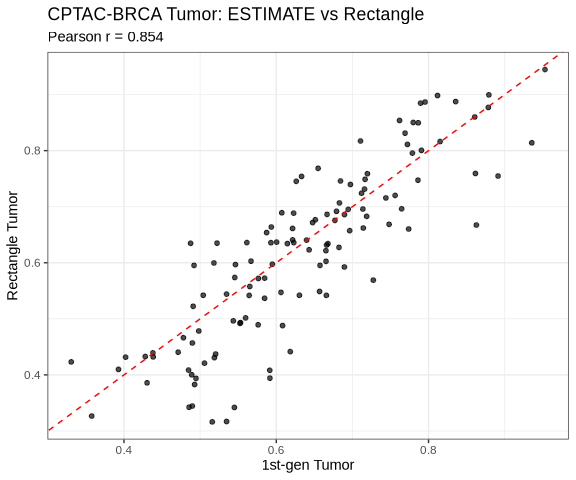
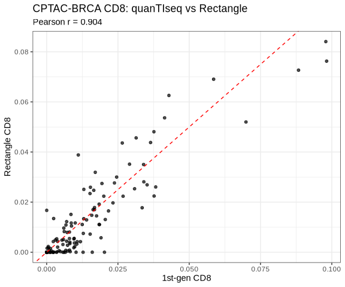
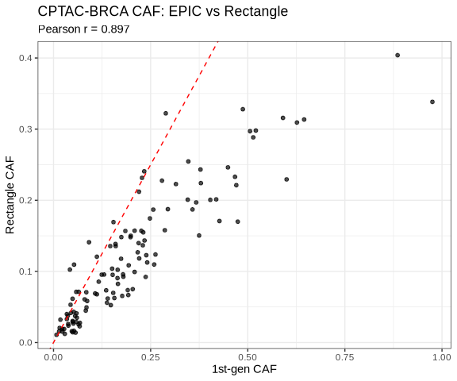
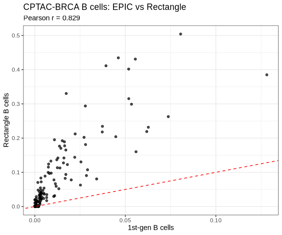

Breast Cancer Architecture Bulk RNA-seq Analysis (CPTAC-BRCA)
================

``` r
library(ggplot2)
library(knitr)
library(jsonlite)

dir.create("../results/bulk_rnaseq/cptac_brca/plots", recursive = TRUE, showWarnings = FALSE)

raw_tab <- read.csv("../results/bulk_rnaseq/cptac_brca/tables/cptac_brca_all_methods_raw.csv", check.names = FALSE)
tab <- read.csv("../results/bulk_rnaseq/cptac_brca/tables/cptac_brca_all_methods_aggregated.csv", check.names = FALSE)
export_tab <- read.csv("../tum_export/deconvolution_results/CPTAC_BRCA_bulk_deconvolution_results_aggregated_rectangle_cell_types.csv", check.names = FALSE)
prep_diag <- fromJSON("../results/bulk_rnaseq/cptac_brca/intermediate/cptac_brca_input_summary.json")
rect_diag <- fromJSON("../results/bulk_rnaseq/cptac_brca/objects/deconv_rectangle_cptac_brca_diagnostics.json")
```

## Methods

- Input dataset:
  `data/bulk_rnaseq/cptac_brca/tpm_matrix_gene_id_name.csv`
- `gene_id` / Ensembl identifiers were removed from the analysis matrix.
- `gene_name` was used as the gene symbol identifier.
- Duplicated gene symbols were resolved by keeping the row with the
  highest mean TPM across all samples.
- 1st generation methods were run through `immunedeconv`:
  - `estimate`
  - `quantiseq`
  - `epic`
- 2nd generation method:
  - `Rectangle`
- Rectangle used the existing Wu reference and current
  `config/rectangle.yaml`.
- No CPTAC clinical/PAM50/survival metadata were joined in this
  workflow.

## Dataset Summary

``` r
summary_df <- data.frame(
  metric = c(
    "n samples",
    "n input rows",
    "n unique gene symbols",
    "n duplicate rows removed",
    "n raw merged columns",
    "n aggregated columns",
    "n export columns",
    "Rectangle gene overlap",
    "Rectangle CPUs"
  ),
  value = c(
    prep_diag$n_samples,
    prep_diag$n_rows_input,
    prep_diag$n_rows_after_duplicate_resolution,
    prep_diag$n_duplicate_rows_removed,
    ncol(raw_tab),
    ncol(tab),
    ncol(export_tab),
    rect_diag$n_genes_overlap,
    rect_diag$n_cpus
  )
)
kable(summary_df)
```

| metric                   | value |
|:-------------------------|------:|
| n samples                |   122 |
| n input rows             | 60660 |
| n unique gene symbols    | 59427 |
| n duplicate rows removed |  1233 |
| n raw merged columns     |    47 |
| n aggregated columns     |    55 |
| n export columns         |    15 |
| Rectangle gene overlap   | 20328 |
| Rectangle CPUs           |    32 |

## Output Preview

``` r
kable(head(export_tab, 10))
```

| sample_id | estimate_tumor | quantiseq_cd8 | epic_caf | epic_bcells | rectangle_aggregated_B_cells | rectangle_aggregated_CAFs | rectangle_aggregated_Tumor_cells | rectangle_aggregated_Dendritic_cells | rectangle_aggregated_Endothelial_cells | rectangle_aggregated_Macrophages | rectangle_aggregated_Monocytes | rectangle_aggregated_NK_cells | rectangle_aggregated_PVL | rectangle_aggregated_T_cells |
|:---|---:|---:|---:|---:|---:|---:|---:|---:|---:|---:|---:|---:|---:|---:|
| 01BR042 | 0.7143347 | 0.0130397 | 0.0144474 | 0.0291024 | 0.1074137 | 0.0156061 | 0.6619056 | 0.0016861 | 0.0209379 | 0.1267818 | 0.0000000 | 0e+00 | 0.0061220 | 0.0580206 |
| 20BR005 | 0.6228275 | 0.0034358 | 0.1987875 | 0.0027617 | 0.0355346 | 0.1500897 | 0.6884351 | 0.0000000 | 0.0253581 | 0.0809781 | 0.0007066 | 0e+00 | 0.0028157 | 0.0158487 |
| 03BR013 | 0.5929620 | 0.0118468 | 0.2387143 | 0.0341358 | 0.0806919 | 0.1227171 | 0.6357497 | 0.0000000 | 0.0566772 | 0.0544649 | 0.0001581 | 0e+00 | 0.0056060 | 0.0424910 |
| 21BR001 | 0.5916467 | 0.0200445 | 0.0471510 | 0.0518391 | 0.4017320 | 0.0159634 | 0.3941869 | 0.0031704 | 0.0131320 | 0.0680049 | 0.0001268 | 0e+00 | 0.0076819 | 0.0763294 |
| 05BR042 | 0.6652428 | 0.0105747 | 0.1115921 | 0.0056293 | 0.0888392 | 0.0678030 | 0.6216488 | 0.0308037 | 0.0241728 | 0.0821589 | 0.0000000 | 0e+00 | 0.0000000 | 0.0823322 |
| 05BR043 | 0.5847296 | 0.0237788 | 0.1507738 | 0.0117670 | 0.0592270 | 0.1038000 | 0.5725082 | 0.0000000 | 0.0300800 | 0.1525512 | 0.0000000 | 0e+00 | 0.0000000 | 0.0765758 |
| 01BR032 | 0.8912881 | 0.0000000 | 0.0494511 | 0.0004963 | 0.0000000 | 0.0144393 | 0.7546580 | 0.0000000 | 0.0342936 | 0.0134031 | 0.1018466 | 0e+00 | 0.0813595 | 0.0000000 |
| 11BR036 | 0.8784371 | 0.0000000 | 0.0584311 | 0.0005691 | 0.0000000 | 0.0289589 | 0.8769984 | 0.0000000 | 0.0584834 | 0.0326092 | 0.0000000 | 1e-07 | 0.0000746 | 0.0028754 |
| 01BR001 | 0.7954347 | 0.0024555 | 0.0383056 | 0.0064912 | 0.0263302 | 0.0237144 | 0.8866255 | 0.0000000 | 0.0178177 | 0.0242107 | 0.0000000 | 0e+00 | 0.0078495 | 0.0134520 |
| 11BR074 | 0.5846726 | 0.0098577 | 0.5207855 | 0.0033065 | 0.0477497 | 0.2979815 | 0.5366944 | 0.0000000 | 0.0610930 | 0.0462166 | 0.0000000 | 0e+00 | 0.0000000 | 0.0083014 |

## Method Comparison

``` r
mk_scatter <- function(df, x, y, title, xlab, ylab, out_png) {
  d <- data.frame(x = as.numeric(df[[x]]), y = as.numeric(df[[y]]))
  d <- d[complete.cases(d), , drop = FALSE]
  r <- if (nrow(d) > 1) cor(d$x, d$y, method = "pearson") else NA_real_
  p <- ggplot(d, aes(x = x, y = y)) +
    geom_point(size = 1.4, alpha = 0.7) +
    geom_abline(slope = 1, intercept = 0, linetype = "dashed", color = "red") +
    labs(
      title = title,
      subtitle = paste0("Pearson r = ", ifelse(is.na(r), "NA", sprintf("%.3f", r))),
      x = xlab,
      y = ylab
    ) +
    theme_bw(base_size = 11)
  ggsave(out_png, p, width = 6, height = 5, dpi = 300, bg = "white")
  print(p)
  invisible(r)
}

comparisons <- data.frame(
  metric = c("Tumor", "CD8", "CAF", "B cells"),
  method = c("ESTIMATE", "quanTIseq", "EPIC", "EPIC"),
  x = c("estimate_tumor", "quantiseq_cd8", "epic_caf", "epic_bcells"),
  y = c("rectangle_tumor", "rectangle_T.cells.CD8.", "rectangle_caf", "rectangle_bcells"),
  stringsAsFactors = FALSE
)

cors <- numeric(nrow(comparisons))
for (i in seq_len(nrow(comparisons))) {
  row <- comparisons[i, ]
  png_path <- file.path("../results/bulk_rnaseq/cptac_brca/plots", paste0("cptac_brca_", make.names(row$metric), "_scatter.png"))
  cors[[i]] <- mk_scatter(
    tab, row$x, row$y,
    paste0("CPTAC-BRCA ", row$metric, ": ", row$method, " vs Rectangle"),
    paste0("1st-gen ", row$metric),
    paste0("Rectangle ", row$metric),
    png_path
  )
}
```

<!-- --><!-- --><!-- --><!-- -->

``` r
comparisons$pearson_r <- cors
kable(comparisons[, c("metric", "method", "x", "y", "pearson_r")])
```

| metric  | method    | x              | y                      | pearson_r |
|:--------|:----------|:---------------|:-----------------------|----------:|
| Tumor   | ESTIMATE  | estimate_tumor | rectangle_tumor        | 0.8536362 |
| CD8     | quanTIseq | quantiseq_cd8  | rectangle_T.cells.CD8. | 0.9041770 |
| CAF     | EPIC      | epic_caf       | rectangle_caf          | 0.8974270 |
| B cells | EPIC      | epic_bcells    | rectangle_bcells       | 0.8292320 |

## Rectangle Export Checks

``` r
agg_cols <- grep("^rectangle_aggregated_", colnames(export_tab), value = TRUE)
sum_with_removed <- rowSums(export_tab[, agg_cols, drop = FALSE], na.rm = TRUE) + tab[["rectangle_NKT.cells"]]
check_df <- data.frame(
  metric = c(
    "n rectangle aggregated export columns",
    "n fine rectangle export columns",
    "n old coarse rectangle export columns",
    "min aggregated + removed NKT",
    "max aggregated + removed NKT"
  ),
  value = c(
    length(agg_cols),
    sum(grepl("^rectangle_fine_", colnames(export_tab))),
    sum(colnames(export_tab) %in% c("rectangle_tumor", "rectangle_cd8", "rectangle_caf", "rectangle_bcells")),
    min(sum_with_removed, na.rm = TRUE),
    max(sum_with_removed, na.rm = TRUE)
  )
)
kable(check_df)
```

| metric                                | value |
|:--------------------------------------|------:|
| n rectangle aggregated export columns |    10 |
| n fine rectangle export columns       |     0 |
| n old coarse rectangle export columns |     0 |
| min aggregated + removed NKT          |     1 |
| max aggregated + removed NKT          |     1 |

## Notes

EPIC reported incomplete optimization convergence for five CPTAC
samples: `05BR042`, `11BR036`, `01BR027`, `14BR005`, and `18BR004`.
Their `epic_caf` and `epic_bcells` values were within the observed CPTAC
range, but these samples should be flagged for EPIC-specific
interpretation.

## Session Info

``` r
sessionInfo()
```

    ## R version 4.3.3 (2024-02-29)
    ## Platform: x86_64-conda-linux-gnu (64-bit)
    ## Running under: Rocky Linux 8.10 (Green Obsidian)
    ## 
    ## Matrix products: default
    ## BLAS/LAPACK: /gpfs/gpfs1/scratch/c9881013/.conda_envs/spacedeconv-env/lib/libmkl_rt.so.2;  LAPACK version 3.9.0
    ## 
    ## locale:
    ##  [1] LC_CTYPE=C.UTF-8       LC_NUMERIC=C           LC_TIME=C.UTF-8       
    ##  [4] LC_COLLATE=C.UTF-8     LC_MONETARY=C.UTF-8    LC_MESSAGES=C.UTF-8   
    ##  [7] LC_PAPER=C.UTF-8       LC_NAME=C              LC_ADDRESS=C          
    ## [10] LC_TELEPHONE=C         LC_MEASUREMENT=C.UTF-8 LC_IDENTIFICATION=C   
    ## 
    ## time zone: Europe/Vienna
    ## tzcode source: system (glibc)
    ## 
    ## attached base packages:
    ## [1] stats     graphics  grDevices utils     datasets  methods   base     
    ## 
    ## other attached packages:
    ## [1] jsonlite_2.0.0 knitr_1.50     ggplot2_3.5.2  rmarkdown_2.29
    ## 
    ## loaded via a namespace (and not attached):
    ##  [1] vctrs_0.6.5        cli_3.6.5          rlang_1.1.6        xfun_0.53         
    ##  [5] generics_0.1.4     textshaping_1.0.1  labeling_0.4.3     glue_1.8.0        
    ##  [9] htmltools_0.5.8.1  ragg_1.5.0         scales_1.4.0       grid_4.3.3        
    ## [13] evaluate_1.0.5     tibble_3.3.0       fastmap_1.2.0      yaml_2.3.10       
    ## [17] lifecycle_1.0.4    compiler_4.3.3     dplyr_1.1.4        RColorBrewer_1.1-3
    ## [21] pkgconfig_2.0.3    systemfonts_1.2.3  farver_2.1.2       digest_0.6.37     
    ## [25] R6_2.6.1           tidyselect_1.2.1   dichromat_2.0-0.1  pillar_1.11.0     
    ## [29] magrittr_2.0.3     withr_3.0.2        tools_4.3.3        gtable_0.3.6
